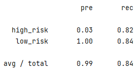
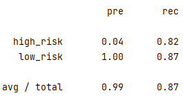
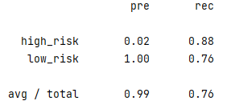
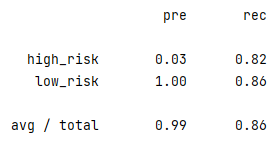
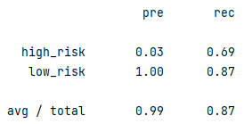
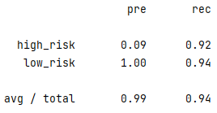

# Credit Risk Analysis

## Project Overview
The goal of this project was to test the performance of a variety of machine learning models on a credit
card dataset from LendingClub. Specifically, to test the predictive power of each model in determining the
credit risk of individuals in the dataset.
The models need to classify individuals into one of two categories, 'high risk' or 'low risk'.
The dataset can be considered highly unbalanced, as the 'high risk' classification represents 347 of 68,817
individuals, or roughly 0.5% of the total.
Each of the below models employs one or more techniques to manage imbalanced data. Generally speaking,
oversampling (models 1 & 2) attempts to manage the problem by increasing the size of the minority class, while undersampling
(model 3) takes the opposite approach, decreasing the size of the majority class.
A combination of over and undersampling is the approach taken by model 4.  The final two models employ a
decision tree type of approach for classification. Models 5 and 6 use a combination of bootstrapping and undersampling, but
each manages tree creation and feature use differently (i.e. use different classification algorithms).
Note: the data was split and scaled in the same way for each model.

## Results

### Balanced Accuracy Scores
| Model                                | Score    |
|--------------------------------------|----------|
| 1. Naive Random Oversampling         | 0.832547 |
| 2. SMOTE Oversampling                | 0.844094 |
| 3. Cluster Centroids                 | 0.820388 |
| 4. SMOTE-ENN                         | 0.838890 |
| 5. Balanced Random Forest Classifier | 0.783713 |
| 6. Easy Ensemble AdaBoost Classifier | 0.931602 |

### Precision and Recall Scores

| Model                                | Score                          |
|--------------------------------------|--------------------------------|
| 1. Naive Random Oversampling         |  |
| 2. SMOTE Oversampling                |  |
| 3. Cluster Centroids                 |  |
| 4. SMOTE-ENN                         |  |
| 5. Balanced Random Forest Classifier |  |
| 6. Easy Ensemble AdaBoost Classifier |  |

### Summary and Recommendations

**Summary**

In credit risk assessment, recall is the more important metric of sucess for a machine learning model. This is because
the cost of false negatives (providing credit to unworthy borrowers) is higher than false positives (denying credit to
worthy borrowers).  The imbalance in the dataset means balanced accuracy scores, reported below for completeness, will not yield
meaningful results.

All models report reasonably good balanced accuracy scores, with model 5 showing the worst balanced score,
at 78%, and model 6 showing the best score, at 93%. Interestingly the decision tree approaches (models 5 and 6) show the 
widest dispersion in balanced accuracy. Models 1 through 4 all used logistic regression for classification
but employeed different sampling techniques as a way to address data imbalance.  Each of those models produced
fairly similar accuracy scores, between 82 and 84%.

Recall scores were fairly high across all models and classifications, though only model 6 produced a score exceeding 90% (at 92% for the **high risk**
classification). Model 5 produces the lowest **high risk** recall score, at 69%.

Precision scores ranged between 2 and 9%. Model 6 yielded the best precison score for the **high risk** group, at 9%, while all 
other models were between 2% and 4% on that metric.
The discrepancy between balanced accuracy scores and the precision and recall scores is unsurprising 
given the imbalanced nature of the dataset.

**Recommendations**

Further research is required to determine whether any of the recall or sensitivity scores would be acceptable in a live
lending environment.  A comparison of the performance of existing risk assessment processess versus the machine learning models employed
here would be helpful in that regard. In addition, an understanding of acceptable losses for a lending business would be instructive
(i.e. is 8% a reasonable cost of doing business).  Model 6 has provided the best recall score, so focusing futher efforts on that model
is advised.
